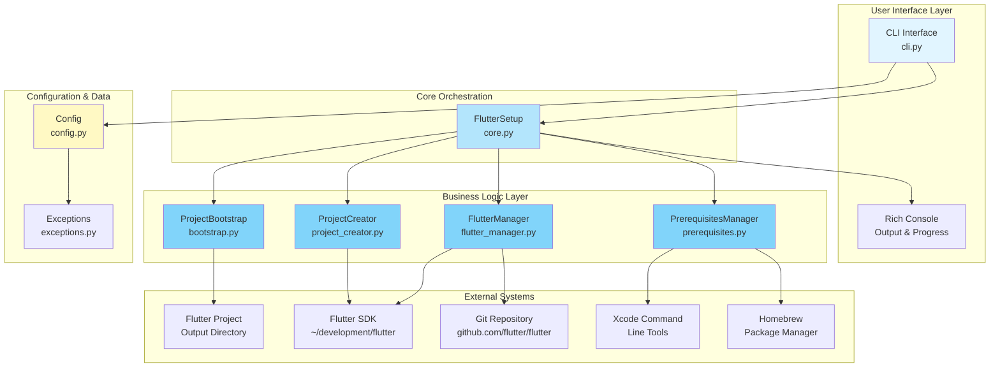
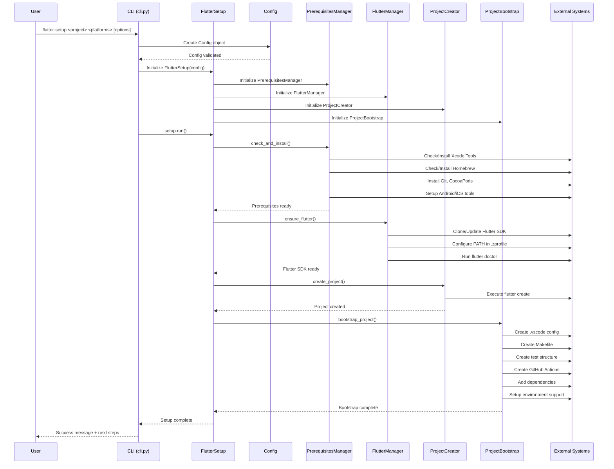
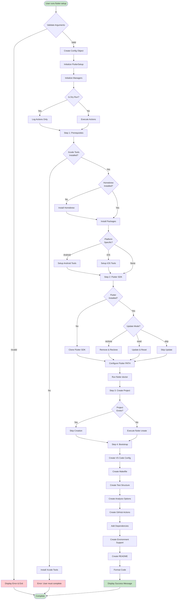
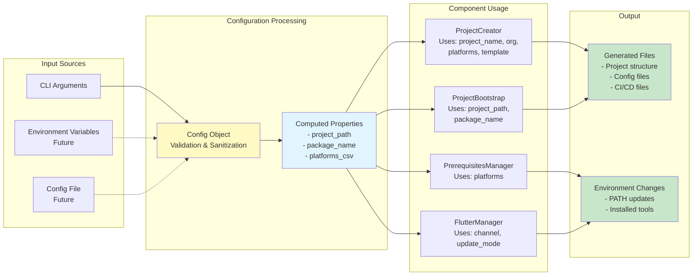

# Flutter Setup - System Architecture

This document provides a comprehensive overview of the Flutter Setup system architecture, including component interactions, execution flows, and system design.

## Table of Contents

1. [System Overview](#system-overview)
2. [Architecture Diagrams](#architecture-diagrams)
   - [System Architecture](#system-architecture)
   - [Component Interaction](#component-interaction)
   - [Execution Flow](#execution-flow)
   - [Data Flow](#data-flow)
3. [Component Details](#component-details)
4. [External Dependencies](#external-dependencies)

---

## System Overview

Flutter Setup is a Python-based CLI tool that automates the complete Flutter development environment setup on macOS. It orchestrates the installation of prerequisites, Flutter SDK, project creation, and development environment bootstrapping.

### Key Characteristics

- **Language**: Python 3.12+
- **CLI Framework**: Click
- **UI/Output**: Rich (for colored terminal output and progress bars)
- **Target Platform**: macOS (primary)
- **Architecture**: Modular, object-oriented design

---

## Architecture Diagrams

### System Architecture

This diagram shows the high-level system architecture and how components interact with external systems.

### Component Interaction

This diagram details how components interact with each other during execution.

### Execution Flow

This diagram shows the detailed execution flow and decision points.

### Data Flow

This diagram illustrates how configuration data flows through the system.

---

## Component Details

### 1. CLI Interface (`cli.py`)

**Purpose**: Entry point for the application, handles command-line argument parsing and user interaction.

**Key Responsibilities**:
- Parse command-line arguments using Click
- Validate user input
- Create Config object from arguments
- Initialize FlutterSetup and execute
- Handle errors and display user-friendly messages

**Dependencies**:
- `click`: CLI framework
- `rich`: Console output formatting
- `core.FlutterSetup`: Main orchestration class
- `config.Config`: Configuration management

### 2. Core Orchestration (`core.py`)

**Purpose**: Orchestrates the entire setup process by coordinating all managers.

**Key Responsibilities**:
- Initialize all manager components
- Execute setup steps in correct order
- Display progress and status updates
- Handle errors and provide context
- Display next steps after completion

**Key Methods**:
- `run()`: Main execution method
- `_run_prerequisites()`: Step 1 - Prerequisites
- `_run_flutter_installation()`: Step 2 - Flutter SDK
- `_run_project_creation()`: Step 3 - Project creation
- `_run_bootstrap()`: Step 4 - Bootstrap environment

### 3. Prerequisites Manager (`prerequisites.py`)

**Purpose**: Manages installation and verification of system prerequisites.

**Key Responsibilities**:
- Check for Xcode Command Line Tools
- Verify/install Homebrew package manager
- Install required packages (Git, CocoaPods)
- Setup platform-specific tools (Android, iOS)
- Configure system paths

**Key Methods**:
- `check_and_install()`: Main entry point
- `_check_xcode_tools()`: Verify Xcode tools
- `_check_homebrew()`: Verify Homebrew
- `_install_packages()`: Install required packages
- `_setup_platform_tools()`: Platform-specific setup

### 4. Flutter Manager (`flutter_manager.py`)

**Purpose**: Manages Flutter SDK installation, updates, and configuration.

**Key Responsibilities**:
- Clone Flutter SDK from GitHub
- Update existing Flutter installations
- Handle Git branch conflicts
- Configure Flutter PATH in shell profile
- Run flutter doctor for validation

**Key Methods**:
- `ensure_flutter()`: Main entry point
- `_install_flutter()`: Clone Flutter SDK
- `_update_flutter()`: Update existing installation
- `_handle_diverged_branches()`: Resolve Git conflicts
- `_ensure_flutter_path()`: Configure PATH
- `_run_flutter_doctor()`: Validate installation

**Update Modes**:
- `reset`: Hard reset to remote state (discards local changes)
- `reclone`: Remove and re-clone repository
- `skip`: Skip update if branches have diverged

### 5. Project Creator (`project_creator.py`)

**Purpose**: Creates Flutter projects using Flutter CLI.

**Key Responsibilities**:
- Build flutter create command with options
- Execute project creation
- Handle existing project directories
- Support app and plugin templates

**Key Methods**:
- `create_project()`: Main entry point
- `_build_create_command()`: Construct flutter create command

**Supported Templates**:
- `app`: Standard Flutter application
- `plugin`: Flutter plugin with platform code

### 6. Project Bootstrap (`bootstrap.py`)

**Purpose**: Bootstraps the development environment with best practices.

**Key Responsibilities**:
- Create VS Code/Cursor configuration
- Generate Makefile with common commands
- Setup test directory structure
- Configure code analysis options
- Create GitHub Actions CI workflows
- Add required dependencies
- Setup environment variable support
- Generate project README

**Key Methods**:
- `bootstrap_project()`: Main entry point
- `_create_vscode_config()`: IDE configuration
- `_create_makefile()`: Build automation
- `_create_test_structure()`: Testing setup
- `_create_github_actions()`: CI/CD setup
- `_add_dependencies()`: Package management
- `_create_environment_support()`: Environment variables

### 7. Configuration (`config.py`)

**Purpose**: Manages configuration data and validation.

**Key Responsibilities**:
- Store all configuration parameters
- Validate input values
- Compute derived properties
- Sanitize package names

**Key Properties**:
- `project_path`: Full path to project directory
- `package_name`: Sanitized package name
- `platforms_csv`: Comma-separated platform list

**Validation Rules**:
- Project name must not be empty
- At least one platform required
- Platforms must be valid (ios, android, web, etc.)
- Template-specific language validation

### 8. Exceptions (`exceptions.py`)

**Purpose**: Custom exception hierarchy for error handling.

**Exception Types**:
- `FlutterSetupError`: Base exception
- `PrerequisitesError`: Prerequisites installation failures
- `FlutterInstallationError`: Flutter SDK installation failures
- `ProjectCreationError`: Project creation failures

---

## External Dependencies

### System Tools

1. **Git**: Required for cloning Flutter SDK
2. **Homebrew**: Package manager for macOS
3. **Xcode Command Line Tools**: Required for iOS development
4. **Flutter SDK**: The Flutter development kit itself

### Python Packages

1. **click** (>=8.1.0): CLI framework
2. **rich** (>=13.0.0): Terminal UI and formatting
3. **requests** (>=2.31.0): HTTP requests (for future features)

### Development Tools

1. **black**: Code formatting
2. **mypy**: Type checking
3. **ruff**: Linting
4. **pytest**: Testing framework

---

## System Execution Model

### Sequential Execution

The system follows a strict sequential execution model:

1. **Prerequisites** → Must complete before Flutter installation
2. **Flutter SDK** → Required for project creation
3. **Project Creation** → Must exist before bootstrapping
4. **Bootstrap** → Final step that enhances the project

### Error Handling

- Each step can raise specific exceptions
- Errors are caught and displayed with context
- Dry-run mode prevents actual changes
- Partial completion is handled gracefully

### State Management

- Configuration is immutable after creation
- Each manager maintains minimal state
- System state is reflected in file system and environment

---

## Future Architecture Considerations

### Planned Enhancements

1. **Configuration File Support**: YAML-based configuration persistence
2. **Cross-Platform Support**: Linux and Windows compatibility
3. **Plugin System**: Extensible architecture for custom templates
4. **Environment Synchronization**: Team-wide environment consistency

### Scalability

The current architecture supports:
- Modular component design for easy extension
- Clear separation of concerns
- Dependency injection via Config object
- Minimal coupling between components

---

## Conclusion

The Flutter Setup system is designed with modularity, maintainability, and extensibility in mind. The clear separation of concerns allows for easy testing, debugging, and future enhancements while providing a robust and user-friendly experience for setting up Flutter development environments.
